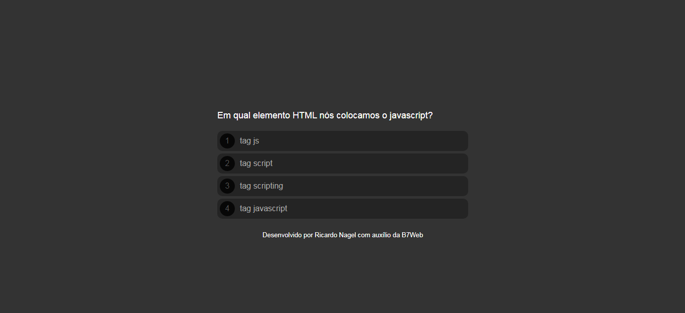
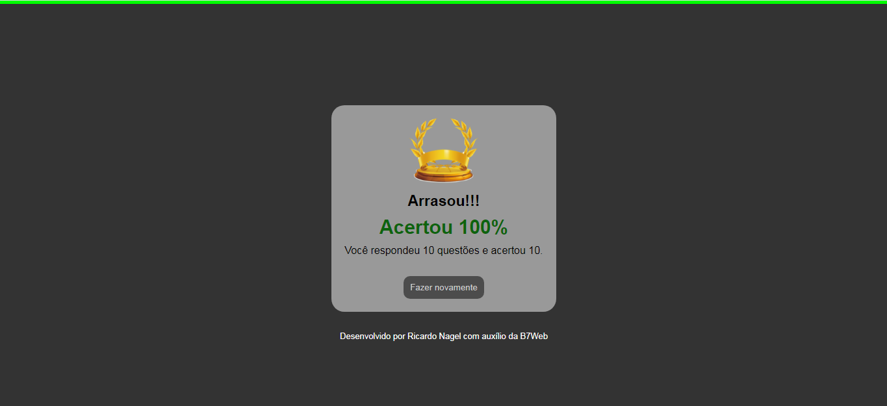

<h1  align="center">Aplicação Quiz - em Javascript puro</h1>

  Quiz é uma aplicação desenvolvida em Javascript puro em que usuário responderá perguntas sobre os fundamentos de javascript.

<h2 id="demonstracao">Demonstração</h2>

  
  

<h2 id="autora">👤 Autor</h2>

<h3>Desenvolvido por Ricardo Nagel com auxílio da B7Web</h3>

* [Linkedin](https://www.linkedin.com/in/ricardonagel/)

  
<strong align="center">Deixe sua ⭐️ se gostou do projeto</strong>

  
